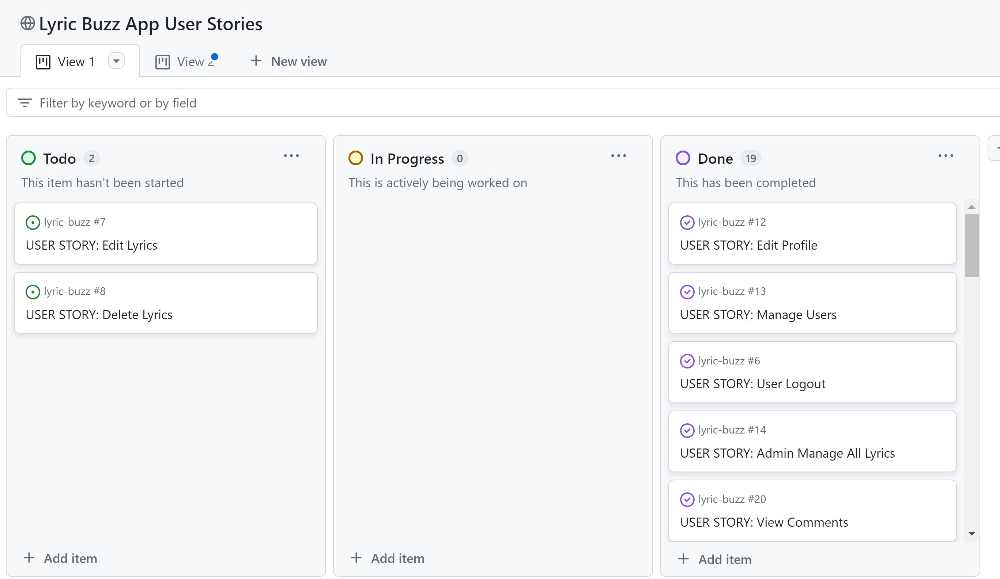

# Welcome to Lyric Buzz

See live site **[here](https://lyric-buzz-9522872a2b81.herokuapp.com/)**

## Table Of Contents:
1. [Design & Planning](#design-&-planning)
    * [User Stories](#user-stories)
    * [Wireframes](#wireframes)
    * [Agile Methodology](#agile-methodology)
    * [Typography](#typography)
    * [Colour Scheme](#colour-scheme)
    * [Database Diagram](#database-diagram)
    
2. [Features](#features)
    * [Navigation](#Navigation-bar)
    * [Footer](#footer)
    * [Home page](#home-page)
    * [add your pages](#)
    * [Login page](#profile-page)
    * [Sign up page](#signup-page)

3. [Technologies Used](#technologies-used)
4. [Libraries](#libraries-used)
5. [Testing](#testing)
6. [Bugs](#bugs)
7. [Deployment](#deployment)
8. [Credits](#credits)
9. [Acknowledgment](#acknowledgment)

## Design & Planning:
Project Title: Lyric Buzz

Description: Lyric Buzz is a website dedicated to providing lyrics for Christian hymns. Users can search, view, like, comment on, and add lyrics. Admins can approve lyrics and comments to ensure content quality.

### Introduction
Lyric Buzz is a dedicated platform for discovering and sharing the timeless beauty of Christian hymns. In a world where music often transcends the spoken word, hymns hold a special place, offering spiritual solace, communal connection, and profound reflection. Lyric Buzz aims to be the go-to resource for hymn enthusiasts, churchgoers, choir members, and anyone who finds inspiration in the lyrics of these spiritual songs.

Our platform not only provides a comprehensive collection of Christian hymn lyrics but also fosters a community where users can engage with the hymns they love. Whether you're searching for the lyrics of a specific hymn, exploring new ones, or contributing by adding your favorites, Lyric Buzz offers a seamless and enriching experience.

### Project Overview
Lyric Buzz is built using the robust Django framework, ensuring a secure, scalable, and efficient platform. The website features user authentication, allowing users to register, log in, and manage their profiles. Once logged in, users can like, comment on, and add new hymn lyrics, subject to admin approval to maintain content quality.

### Key features of Lyric Buzz include:

**User Authentication:** Secure registration and login processes enable users to interact with the site’s features fully.

**Lyric Management:** Users can browse approved lyrics, add new ones, like their favorites, and engage with the community through comments.

**Admin Panel:** Administrators have the power to approve or reject lyrics and comments, ensuring the content remains appropriate and high-quality.

**Search Functionality:** An intuitive search bar allows users to find hymns quickly by title or lyrics.

**Responsive Design:** The site is designed to be accessible and user-friendly across all devices, from desktops to mobile phones.

### Goals

The primary goal of Lyric Buzz is to create a welcoming and user-friendly environment where individuals can immerse themselves in the lyrical richness of Christian hymns. By providing easy access to these lyrics, we hope to enhance both personal devotion and communal worship experiences.

### Target Audience

Our target audience includes:

- Church Members: Individuals looking for hymn lyrics for worship services and personal devotion.
- Choir Members: Singers seeking lyrics for practice and performance.
- Music Enthusiasts: People interested in the lyrical and historical aspects of Christian hymns.
- General Public: Anyone who finds solace and inspiration in the words of hymns.

### User Stories

Users
- As a visitor, I can view the homepage so that I can understand the purpose of the site.
- As a visitor, I can search for lyrics so that I can find specific hymns.
- As a user, I can register for an account so that I can like, comment on, and add lyrics.
- As a user, I can log in and out so that I can access my account features.
- As a user, I can like lyrics so that I can show my appreciation for them.
- As a user, I can comment on lyrics so that I can share my thoughts (admin approval required).
- As a user, I can add new lyrics so that I can contribute to the site (admin approval required).

Admins
- As an admin, I can approve or reject lyrics so that I can control the quality of content on the site.
- As an admin, I can approve or reject comments so that I can maintain a positive community environment.
- As an admin, I can manage all user content through the admin panel.

You can see full user stories [here](https://github.com/users/msamarpanraj/projects/3) 

### Wireframes
Attach wireframes in this section
### Agile Methodology

GitHub Projects

GitHub Projects served as our primary Agile tool for managing this project. 
We used GitHub Projects to plan, track, and manage user stories, issues, and tasks time to time via a basic Kanban board.

To prioritize tasks efficiently within the available time, we employed the MoSCoW method, supplemented by custom GitHub project labels.

GitHub Issues
GitHub Issues was another crucial tool in our Agile process. Using a custom User Story Template, we managed and tracked user stories effectively.

Open Issues

Closed Issues

MoSCoW Prioritization
We decomposed our Epics into smaller stories before prioritizing and implementing them. This approach allowed us to apply MoSCoW prioritization and labels to our user stories within the Issues tab.

- Must Have: Tasks that are guaranteed to be delivered (maximum 60% of stories)
- Should Have: Tasks that add significant value but are not vital (approximately 20% of stories)
- Could Have: Tasks with a small impact if left out (20% of stories)
- Won't Have: Tasks that are not a priority for this iteration
This prioritization ensured that we focused on delivering the most critical features first while also planning for additional value-added tasks as time allowed.

### Typography
Explain font you've used for your project
### Colour Scheme
Screenshoot of the colour scheme for your project
### DataBase Diagram
Image of the database diagram for your project, you can name your database models as well and how they are connected

## Features:
Navigation Bar

Footer

Home Page
URL: Home

Description: The home page introduces the user to the site and allows them to search for lyrics.
Features:
Search Bar: Users can search for specific song lyrics.
Recently Published Lyrics: Displays a list of the most recently added lyrics with details such as song name, posted by, album, lyric writer, and publication date.
Navigation: Links to Home, About, All Lyrics, Register, and Login pages.
## Technologies Used
List of technologies used for your project
## Testing
Important part of your README!!!
### Google's Lighthouse Performance
Screenshots of certain pages and scores (mobile and desktop)
### Browser Compatibility
Check compatability with different browsers (Firefox, Edge, Chrome)
### Responsiveness
Screenshots of the responsivness, pick few devices
### Code Validation
Validate your code HTML, CSS, JS & Python (Validate all your templates, static files, views, forms, models, urls), display screenshots
### Manual Testing user stories
Test all your user stories, you an create table 
User Story |  Test | Pass
--- | --- | :---:
paste here you user story | what is visible to the user and what action they should perform | &check;
- attach screenshot
### Manual Testing features
Test all your features, you can use the same approach 
| Status | feature
|:-------:|:--------|
| &check; | description
- attach screenshot
### Automated testing
If you created automated tests, insert screenshoots of your coverage and number of tests
## Bugs
List of bugs and how did you fix them, you can create simple table
| Bug | Fix
|:-------:|:--------|
|   |    |
## Deployment
This website is deployed to Heroku from a GitHub repository, the following steps were taken:

#### Creating Repository on GitHub
- First make sure you are signed into [Github](https://github.com/) and go to the code institutes template, which can be found [here](https://github.com/Code-Institute-Org/gitpod-full-template).
- Then click on **use this template** and select **Create a new repository** from the drop-down. Enter the name for the repository and click **Create repository from template**.
- Once the repository was created, I clicked the green **gitpod** button to create a workspace in gitpod so that I could write the code for the site.

#### Creating an app on Heroku
- After creating the repository on GitHub, head over to [heroku](https://www.heroku.com/) and sign in.
- On the home page, click **New** and **Create new app** from the drop down.
- Give the app a name(this must be unique) and select a **region** I chose **Europe** as I am in Europe, Then click **Create app**.

#### Create a database On ElephantSQL
- Log into the [ElephantSQL](https://www.elephantsql.com/) website and click **Create new Instance**
- Enter a **Name** and keep the plan as **Tiny Turtle Free**, then **tags** field can be left blank, Select a region closest to you, I selected **EU-West-1(Ireland)** as I'm in Ireland. Then click **Review** and afterward click **create an instance**.
- On The Dashboard click on your database instance name.
- You will see the details for your database instance, in the URL section click on the copy icon to copy the database URL.
- Head over to gitpod and create a **Database URL** environment variable in your env.py file and set it equal to the copied URL.

#### Deploying to Heroku.
- Head back over to [heroku](https://www.heroku.com/) and click on your **app** and then go to the **Settings tab**
- On the **settings page** scroll down to the **config vars** section and enter the **DATABASE_URL** which you will set equal to the elephantSQL URL, create **Secret key** this can be anything,
**CLOUDINARY_URL** this will be set to your cloudinary url and finally **Port** which will be set to 8000.
- Then scroll to the top and go to the **deploy tab** and go down to the **Deployment method** section and select **Github** and then sign into your account.
- Below that in the **search for a repository to connect to** search box enter the name of your repository that you created on **GitHub** and click **connect**
- Once it has been connected scroll down to the **Manual Deploy** and click **Deploy branch** when it has deployed you will see a **view app** button below and this will bring you to your newly deployed app.
- Please note that when deploying manually you will have to deploy after each change you make to your repository.
## Credits
List of used resources for your website (text, images, snippets of code, projects....)
## Acknowledgment
Mention people who helped you with your project(mentor, colleagues...)