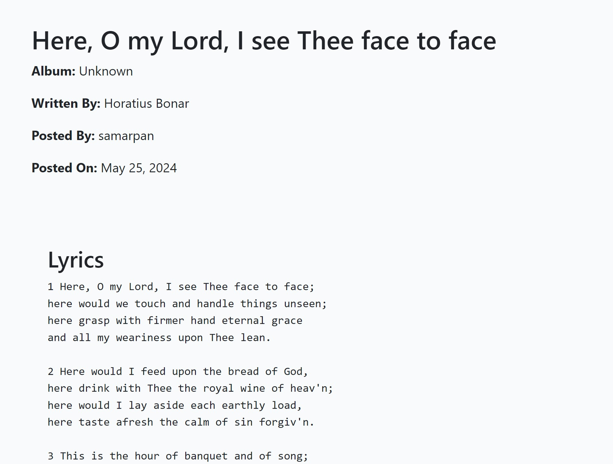

# Welcome to Lyric Buzz

See live site **[here](https://lyric-buzz-9522872a2b81.herokuapp.com/)**

## Table Of Contents:

## Design & Planning:
Project Title: Lyric Buzz

Description: Lyric Buzz is a website dedicated to providing lyrics for Christian hymns. Users can search, view, like, comment on, and add lyrics. Admins can approve lyrics and comments to ensure content quality.

### Introduction
Lyric Buzz is a dedicated platform for discovering and sharing the timeless beauty of Christian hymns. In a world where music often transcends the spoken word, hymns hold a special place, offering spiritual solace, communal connection, and profound reflection. Lyric Buzz aims to be the go-to resource for hymn enthusiasts, churchgoers, choir members, and anyone who finds inspiration in the lyrics of these spiritual songs.

Our platform not only provides a comprehensive collection of Christian hymn lyrics but also fosters a community where users can engage with the hymns they love. Whether you're searching for the lyrics of a specific hymn, exploring new ones, or contributing by adding your favorites, Lyric Buzz offers a seamless and enriching experience.

### Project Overview
Lyric Buzz is built using the robust Django framework, ensuring a secure, scalable, and efficient platform. The website features user authentication, allowing users to register, log in, and manage their profiles. Once logged in, users can like, comment on, and add new hymn lyrics, subject to admin approval to maintain content quality.

### Key features of Lyric Buzz include:

**User Authentication:** Secure registration and login processes enable users to interact with the site’s features fully.

**Lyric Management:** Users can browse approved lyrics, add new ones, like their favorites, and engage with the community through comments.

**Admin Panel:** Administrators have the power to approve or reject lyrics and comments, ensuring the content remains appropriate and high-quality.

**Search Functionality:** An intuitive search bar allows users to find hymns quickly by title or lyrics.

**Responsive Design:** The site is designed to be accessible and user-friendly across all devices, from desktops to mobile phones.

### Goals

The primary goal of Lyric Buzz is to create a welcoming and user-friendly environment where individuals can immerse themselves in the lyrical richness of Christian hymns. By providing easy access to these lyrics, we hope to enhance both personal devotion and communal worship experiences.

### Target Audience

Our target audience includes:

- Church Members: Individuals looking for hymn lyrics for worship services and personal devotion.
- Choir Members: Singers seeking lyrics for practice and performance.
- Music Enthusiasts: People interested in the lyrical and historical aspects of Christian hymns.
- General Public: Anyone who finds solace and inspiration in the words of hymns.

### User Stories

Users
- As a visitor, I can view the homepage so that I can understand the purpose of the site.
- As a visitor, I can search for lyrics so that I can find specific hymns.
- As a user, I can register for an account so that I can like, comment on, and add lyrics.
- As a user, I can log in and out so that I can access my account features.
- As a user, I can like lyrics so that I can show my appreciation for them.
- As a user, I can comment on lyrics so that I can share my thoughts (admin approval required).
- As a user, I can add new lyrics so that I can contribute to the site (admin approval required).

Admins
- As an admin, I can approve so that I can control the quality of content on the site.
- As an admin, I can approve or reject comments so that I can maintain a positive community environment.
- As an admin, I can manage all user content through the admin panel.

You can see full user stories [here](https://github.com/users/msamarpanraj/projects/3) 

### Wireframes
Attach wireframes in this section
### Agile Methodology

GitHub Projects

GitHub Projects served as our primary Agile tool for managing this project. 
We used GitHub Projects to plan, track, and manage user stories, issues, and tasks time to time via a basic Kanban board.

To prioritize tasks efficiently within the available time, we employed the MoSCoW method, supplemented by custom GitHub project labels.

GitHub Issues
GitHub Issues was another crucial tool in our Agile process. Using a custom User Story Template, we managed and tracked user stories effectively.

Open Issues

Closed Issues

MoSCoW Prioritization
We decomposed our Epics into smaller stories before prioritizing and implementing them. This approach allowed us to apply MoSCoW prioritization and labels to our user stories within the Issues tab.

- Must Have: Tasks that are guaranteed to be delivered (maximum 60% of stories)
- Should Have: Tasks that add significant value but are not vital (approximately 20% of stories)
- Could Have: Tasks with a small impact if left out (20% of stories)
- Won't Have: Tasks that are not a priority for this iteration
This prioritization ensured that we focused on delivering the most critical features first while also planning for additional value-added tasks as time allowed.

### Typography
Used the default bootstrap fonts

### Colour Scheme
 

### DataBase Diagram
Image of the database diagram for your project, you can name your database models as well and how they are connected

## Features:
Existing Features

#### Navigation

**For Logged In Users**:

- Home
- About
- All Lyrics
- Add New Lyric
- My Profile
- Logout

**For Logged Out Users**:

- Home
- About
- All Lyrics
- Register
- Login

**Search Field**:
- A search field and button are available to search for lyrics.

Footer

All pages

- **Homepage**
   
    

- **Hero Section**: 
  - Background image with a search field and button.
  - Users can only click the search button after entering a query in the search field.

- **Recently Published Lyrics**:
  - Display of the most recently published lyrics.

- **Pagination**:
  - Users can navigate through pages of lyrics.

#### About Page
- **Introduction**:
  - A brief introduction about the site and its purpose.

#### All Lyrics Page
- **Lyrics List**:
  - Display of all lyrics with pagination.
  - Each lyric entry shows:
    - Song Name
    - Posted By
    - Album
    - Lyric Writer
    - Published On

- **Lyric Details**:

  - Clicking on a song takes the user to the individual lyric detail page with the same details.
  

  - Users can like, unlike, and comment on lyrics if logged in.
  - Comments are visible once approved by admin.
  

  - Number of likes and comments are displayed.
  

  - Users can delete their own comments with a modal popup warning before deletion.
  

 - Users who did not logged in will see this at the comments area with a link to login page which redirects to previous page.
  

#### Register Page
- **Registration Form**:
  - Users can fill in their name, email (optional), and password twice to register.
  - Error messages are displayed for mandatory fields if not filled.

- **Post-Registration**:

  - Users are automatically logged in and redirected to the homepage.

#### Login Page
- **Login Form**:
  - Users can enter their username and password to sign in.

- **Post-Login**:

  - Users are redirected to the homepage and can now see "Add New Lyric" and "My Profile" links in the navigation.

#### Logout
- **Logout Confirmation**:
  - Clicking logout shows a confirmation page with a sign out button.
  - Users are signed out after confirmation.

#### Add New Lyric
- **New Lyric Form**:

  - Users can fill out a form to submit new lyrics.
  - Submitted lyrics need admin approval to be visible on the website.

#### Profile Page
- **Profile Details**:

  - Users can view and edit their profile, including bio and profile picture.

  - Alert message is displayed upon successful update.

- **Published Lyrics**:

  - Users can see all lyrics they have published.
  - If a lyric is not yet published, it won't have a link.
  - Users can edit or delete their lyrics.

  
  - Modal popup for deletion confirmation.

  
  - Pagination is available if multiple lyrics are published.

  
  - Message displayed if no lyrics are published with a link to add new lyrics.

#### Search Functionality
- **Search Button**:
  - Error message if the search button is clicked without entering a query.
  

  - Displays search results page with:
    - Search Results
    - Results for "query"
    - Number of results found
    - List of lyrics matching the search query

## Technologies Used
- [HTML](https://en.wikipedia.org/wiki/HTML) used for the main site content.
- [CSS](https://en.wikipedia.org/wiki/CSS) used for the main site design and layout.
- [Bootstrap](https://getbootstrap.com) used as the front-end CSS framework for modern responsiveness and pre-built components.
- [JavaScript](https://www.javascript.com) used for user interaction on the site for automatically closing Django Messages and to handle the notification dropdown and notification delete functions.
- [Python](https://www.python.org) used as the back-end programming language.
- [Git](https://git-scm.com) used for version control. (`git add`, `git commit`, `git push`)
- [GitHub](https://github.com) used for secure online code storage.
- [Gitpod](https://gitpod.io) used as a cloud-based IDE for development.
- [Markdown Builder by Tim Nelson](https://traveltimn.github.io/markdown-builder) used to help generate the Markdown files.
- [Django](https://www.djangoproject.com) used as the Python framework for the site.
- [PostgreSQL](https://www.postgresql.org) used as the relational database management.
- [PostgreSQL from Code Institute](https://dbs.ci-dbs.net/) used as the Postgres database.
- [Heroku](https://www.heroku.com) used for hosting the deployed back-end site.
- [Cloudinary](https://cloudinary.com) used for online static file storage.
- [Unsplash](https://www.unsplash.com/) used for images.
- [Website Mockup Generator](https://websitemockupgenerator.com/) used to create the mockup image used in my readme.
- [Gmail](https://www.google.com/gmail/about/) used to create an email address to send password reset emails from.
- [Flaticon](https://www.flaticon.com/free-icons/lyrics) used to get the icons
- [Balsamiq](https://balsamiq.com/wireframes) used to design my site wireframes.
- [Code Spell Checker](https://marketplace.visualstudio.com/items?itemName=streetsidesoftware.code-spell-checker) used to check for typos in my README and TESTING files.

## Testing
All testing results can be found here [TESTING.md](TESTING.md)

## Deployment
This website is deployed to Heroku from a GitHub repository, the following steps were taken:

#### Creating Repository on GitHub
- First make sure you are signed into [Github](https://github.com/) and go to the code institutes template, which can be found [here](https://github.com/Code-Institute-Org/gitpod-full-template).
- Then click on **use this template** and select **Create a new repository** from the drop-down. Enter the name for the repository and click **Create repository from template**.
- Once the repository was created, I clicked the green **gitpod** button to create a workspace in gitpod so that I could write the code for the site.

#### Creating an app on Heroku
- After creating the repository on GitHub, head over to [heroku](https://www.heroku.com/) and sign in.
- On the home page, click **New** and **Create new app** from the drop down.
- Give the app a name(this must be unique) and select a **region** I chose **Europe** as I am in Europe, Then click **Create app**.

#### Create a database On ElephantSQL
- Log into the [PostgreSQL from Code Institute
](https://dbs.ci-dbs.net/) website and enter your email and **click submit**
- As soon as you sign up you will recieve a email with all the details about your PostgreSQL database.
- You will find the postgres url, copy that.
- Head over to gitpod and create a **Database URL** environment variable in your env.py file and set it equal to the copied URL.

#### Deploying to Heroku.
- Head back over to [heroku](https://www.heroku.com/) and click on your **app** and then go to the **Settings tab**
- On the **settings page** scroll down to the **config vars** section and enter the **DATABASE_URL** which you will set equal to the elephantSQL URL, create **Secret key** this can be anything,
**CLOUDINARY_URL** this will be set to your cloudinary url and finally **Port** which will be set to 8000.
- Then scroll to the top and go to the **deploy tab** and go down to the **Deployment method** section and select **Github** and then sign into your account.
- Below that in the **search for a repository to connect to** search box enter the name of your repository that you created on **GitHub** and click **connect**
- Once it has been connected scroll down to the **Manual Deploy** and click **Deploy branch** when it has deployed you will see a **view app** button below and this will bring you to your newly deployed app.
- Please note that when deploying manually you will have to deploy after each change you make to your repository.

Heroku needs two additional files in order to deploy properly.
- requirements.txt
- Procfile

You can install this project's **requirements** (where applicable) using:
- `pip3 install -r requirements.txt`

If you have your own packages that have been installed, then the requirements file needs updated using:
- `pip3 freeze --local > requirements.txt`

The **Procfile** can be created with the following command:
- `echo web: gunicorn app_name.wsgi > Procfile`
- *replace **app_name** with the name of your primary Django app name; the folder where settings.py is located*

For Heroku deployment, follow these steps to connect your own GitHub repository to the newly created app:

Either:
- Select **Automatic Deployment** from the Heroku app.

Or:
- In the Terminal/CLI, connect to Heroku using this command: `heroku login -i`
- Set the remote for Heroku: `heroku git:remote -a app_name` (replace *app_name* with your app name)
- After performing the standard Git `add`, `commit`, and `push` to GitHub, you can now type:
	- `git push heroku main`

The project should now be connected and deployed to Heroku!

## Credits
List of used resources for your website (text, images, snippets of code, projects....)
## Acknowledgment
Mention people who helped you with your project(mentor, colleagues...)