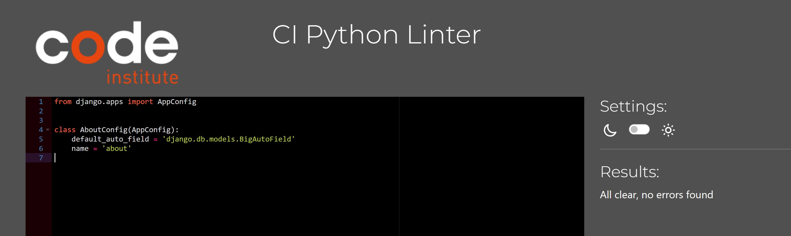
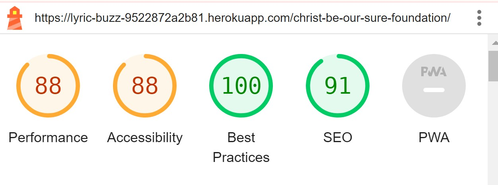

# Testing

Return back to the [README.md](README.md) file.

## Code Validation

### HTML

[HTML W3C Validator](https://validator.w3.org) used to to validate all HTML code.

In order to properly validate my HTML pages with Jinja syntax for authenticated pages, I followed these steps:

- Navigate to the deployed pages which require authentication
- Right-click anywhere on the page, and select **View Page Source** (usually `CTRL+U` or `⌘+U` on Mac).
- This will display the entire "compiled" code, without any Jinja syntax.
- Copy everything, and use the [validate by input](https://validator.w3.org/#validate_by_input) method.
- Repeat this process for every page that requires a user to be logged-in/authenticated.

| Page | W3C URL | Screenshot | Notes |
| --- | --- | --- | --- |
| Home | [W3C](https://validator.w3.org/nu/?doc=https%3A%2F%2Flyric-buzz-9522872a2b81.herokuapp.com%2F) |  | Pass: No Errors |
| Sign Up | [W3C](https://validator.w3.org/nu/?doc=https%3A%2F%2Flyric-buzz-9522872a2b81.herokuapp.com%2Faccounts%2Fsignup%2F) |  | This error is in the signup template. It is caused by the helper text given by the allauth.account.forms SignupForm(BaseSignupForm) |
| Log In | [W3C](https://validator.w3.org/nu/?doc=https%3A%2F%2Flyric-buzz-9522872a2b81.herokuapp.com%2Faccounts%2Flogin%2F) |  | Pass: No Errors |
| About Page | [W3C](https://validator.w3.org/nu/?doc=https%3A%2F%2Flyric-buzz-9522872a2b81.herokuapp.com%2Fabout%2F) |  | Pass: No Errors |
| All Lyrics Page| [W3C](https://validator.w3.org/nu/?doc=https%3A%2F%2Flyric-buzz-9522872a2b81.herokuapp.com%2Flyrics%2F) |  | Pass: No Errors |
| Lyric Detail Page | n/a |  | Pass: No Errors |
| Search Results Page | n/a |  | Pass: No Errors |
| Profile Page | n/a |  | Pass: No Errors |
| Add Lyrics Page | n/a |  | Summernote widget used for lyric submission form and that is causing these errors. |
| Edit Lyrics Page | n/a |  | Pass: Summernote widget used for lyric edit form and that is causing these errors. |
| 404 | n/a |  | Pass: No Errors |
| 403 | n/a |  | Pass: No Errors |
| 500 | n/a |  | Pass: No Errors |

### CSS

Used [CSS Jigsaw Validator](https://jigsaw.w3.org/css-validator) to validate my CSS file. 
| File | Jigsaw URL | Screenshot | Notes |
| --- | --- | --- | --- |
| style.css | [Jigsaw]() |  | Pass: No Errors |

### JavaScript

I have used the recommended [JShint Validator](https://jshint.com) to validate all of my JS files.

| File | Screenshot | Notes |
| --- | --- | --- |
| comments.js |  | Undefined variable Bootstrap |

### Python

I have used the recommended [CI Python Linter](https://pep8ci.herokuapp.com) to validate all of my Python files.

| File | Screenshot | Notes |
| --- | --- | --- |
| settings.py |  | There are some errors and they have been fixed |
| settings.py |  | Pass: No Errors |
| urls.py (main) |  | Pass: No Errors |
| admin.py |  | Pass: No Errors |
| signals.py |  | Pass: No Errors |
| forms.py |  | Pass: No Errors |
| apps.py (lyrics app) |  | Pass: No Errors |
| models.py (lyrics app) |  | Pass: No Errors |
| urls.py (lyrics app) |  | Pass: No Errors |
| views.py (lyrics app) |  | Pass: No Errors |
| admin.py (about app) |  | Pass: No Errors |
| apps.py (about app) |  | Pass: No Errors |
| models.py (about app) |  | Pass: No Errors |
| urls.py (about app) |  | Pass: No Errors |
| views.py (about app) |  | Pass: No Errors |

## Browser Compatibility

I've tested my deployed project on multiple browsers to check for compatibility issues.

| Browser | Screenshot | Notes |
| --- | --- | --- |
| Chrome |  | Works as expected |
| Brave |  | Works as expected |
| Edge |  | Works as expected |

## Responsiveness

I've tested my deployed project on multiple devices to check for responsiveness issues.

| Device | Screenshot | Notes |
| --- | --- | --- |
| Mobile (DevTools) |  | Works as expected |
| Tablet (DevTools) |  | Works as expected |
| Laptop |  | Works as expected |
| Desktop |  | Works as expected |

## Lighthouse Audit

I've tested my deployed project using the Lighthouse Audit tool to check for any major issues.

| Page | Size | Screenshot | Notes |
| --- | --- | --- | --- |
| Home | Desktop |  | No major warnings |
| Home | Mobile |  | Some minor warnings |
| Sign Up | Desktop |  | No major warnings |
| Sign Up | Mobile |  | No major warnings |
| Sign In | Desktop |  | No major warnings |
| Sign In | Mobile |  | No major warnings |
| Profile | Desktop |  | No major warnings |
| Profile | Mobile |  | No major warnings |
| About | Desktop |  | No major warnings |
| About | Mobile |  | Some minor warnings |
| All Lyrics | Desktop |  | No major warnings |
| All Lyrics | Mobile |  | No major warnings |
| Lyric Detail | Desktop |  | No major warnings |
| Lyric Detail | Mobile |  | Some minor warnings |
| Add Lyric | Desktop |  | No major warnings |
| Add Lyric | Mobile |  | Some minor warnings |
| Search | Desktop |  | No major warnings |
| Search | Mobile |  | No major warnings |

## Defensive Programming

Defensive programming was manually tested with the below user acceptance testing:

| Page | User Action | Expected Result | Pass/Fail | Comments |
| --- | --- | --- | --- | --- |
| **Nav links - Logged Out Users** | | | | |
| Navigation | Click on Home link in navbar | Redirection to Home page | Pass | |
| Navigation | Click on About link in navbar | Redirection to About page | Pass | |
| Navigation | Click on All Lyrics link in navbar | Redirection to All Lyrics page | Pass | |
| Navigation | Click on Register link in navbar | Redirection to Register page | Pass | |
| Navigation | Click on Login link in navbar | Redirection to Login page | Pass | |
| Navigation | Enter text in search field and click Search button | Redirection to Search Results page | Pass | |
| Navigation | Click Search button without entering text | Display error message "Please fill in the field" | Pass | |
| **Nav links - Logged In Users** | | | | |
| Navigation | Click on Home link in navbar | Redirection to Home page | Pass | |
| Navigation | Click on About link in navbar | Redirection to About page | Pass | |
| Navigation | Click on All Lyrics link in navbar | Redirection to All Lyrics page | Pass | |
| Navigation | Click on Add New Lyric link in navbar | Redirection to Add New Lyric page | Pass | |
| Navigation | Click on My Profile link in navbar | Redirection to User Profile page | Pass | |
| Navigation | Enter text in search field and click Search button | Redirection to Search Results page | Pass | |
| Navigation | Click Search button without entering text | Display error message "Please fill in the field" | Pass | |
| **Home Page** | | | | |
| Home Page | Hero section background image and search functionality | Hero section displayed with background image and search field/button. Search button enabled only when the search field is filled. | Pass | |
| Home Page | Recently published lyrics and pagination | Recently published lyrics displayed with pagination controls functional | Pass | |
| **Register Page** | | | | |
| Register Page | Enter valid username, email (optional), and password (twice) | Field validation for email format, password matching | Pass | |
| Register Page | Submit registration form | User is registered, logged in, and redirected to the homepage | Pass | |
| **Login Page** | | | | |
| Login Page | Enter valid username and password | Field validation for username and password format | Pass | |
| Login Page | Submit login form | User is logged in and redirected to the homepage | Pass | |
| **Logout Functionality** | | | | |
| Logout Page | Click on logout link | Redirection to a confirmation page | Pass | |
| Logout Page | Confirm logout | User is logged out and redirected to the homepage | Pass | |
| **Search Functionality** | | | | |
| Search Page | Enter search query and click Search button | Display search results page with results matching the query | Pass | |
| Search Page | Click Search button without entering text | Display error message "Please fill in the field" | Pass | |
| **All Lyrics Page** | | | | |
| All Lyrics Page | View all lyrics with pagination | List of lyrics with details (Song name, Posted By, Album, Lyric Writer, Published on) and pagination controls functional | Pass | |
| All Lyrics Page | Click on a lyric title | Redirection to Lyric Detail page | Pass | |
| **Lyric Detail Page** | | | | |
| Lyric Detail Page | View lyric details | Song name, Posted By, Album, Lyric Writer, Published on, number of likes and comments | Pass | |
| Lyric Detail Page | Click like button | Like is registered and like count updates | Pass | |
| Lyric Detail Page | Add a comment | Comment is added and awaits admin approval | Pass | |
| Lyric Detail Page | Delete own comment | Comment is deleted after confirmation in modal popup | Pass | |
| **Add New Lyric Page** | | | | |
| Add New Lyric Page | Fill out the form and submit | Lyric is added and awaits admin approval | Pass | |
| Add New Lyric Page | Save a draft | Draft is saved and listed in drafts section | Pass | |
| **Profile Page** | | | | |
| Profile Page | View user profile details | User profile information and list of published lyrics | Pass | |
| Profile Page | Edit profile information | Profile is updated and alert message is shown | Pass | |
| Profile Page | View list of published lyrics | List of user's published lyrics with edit and delete buttons | Pass | |
| Profile Page | Edit a lyric | Existing information is shown in the form fields, lyric is updated, and alert message is shown | Pass | |
| Profile Page | Delete a lyric | Lyric is permanently deleted after confirmation in modal popup | Pass | |

## User Story Testing

The following are user stories I've implemented 

| User Story | Feature | Test | Expected Result | Actual Result |
| --- | --- | --- | --- | --- |
| USER STORY: Delete Lyrics | Profile Page | Click delete button, confirm in modal popup | Lyric is permanently deleted | Works as expected |
| USER STORY: Edit Lyrics | Profile Page | Click edit button, update form, and submit | Lyric is updated and alert message is shown | Works as expected |
| USER STORY: Edit Profile | Profile Page | Click edit profile button, update form, and submit | Profile is updated and alert message is shown | Works as expected |
| USER STORY: Manage Users | Admin Dashboard | Admin view user list and manage roles | User roles are updated as needed | Works as expected |
| USER STORY: User Logout | Navigation | Click logout link and confirm logout | User is logged out and redirected to homepage | Works as expected |
| USER STORY: Admin Manage All Lyrics | Admin Dashboard | View submitted lyrics and approve | Lyrics are approved or left like that | Works as expected |
| USER STORY: View Comments | Lyric Detail Page | View list of comments under lyrics | Comments are displayed along with number of likes and replies | Works as expected |
| USER STORY: View Profile | Profile Page | Navigate to My Profile page | Display user profile details and list of added lyrics | Works as expected |
| USER STORY: Comment on Lyrics | Lyric Detail Page | Add a comment to a lyric | Comment is added and awaits admin approval | Works as expected |
| USER STORY: Submit Lyrics | Add New Lyric Page | Fill out the form and submit | Lyric is added and awaits admin approval | Works as expected |
| USER STORY: Like Lyrics | Lyric Detail Page | Click like button | Like is registered and like count updates | Works as expected |
| USER STORY: User Login | Login Page | Enter valid credentials and submit | User is logged in and redirected to homepage | Works as expected |
| FRAMEWORK: Install Django | Setup | Install Django and set up project | Django installed and project setup complete | Works as expected |
| USER STORY: Lyric Detail Page | Lyric Detail Page | Click on a lyric title from the list | Detailed view of lyric is displayed | Works as expected |
| USER STORY: View Lyrics | All Lyrics Page | Navigate to All Lyrics page | Display list of all lyrics with pagination | Works as expected |
| USER STORY: User Registration | Register Page | Fill out registration form and submit | User is registered, logged in, and redirected to homepage | Works as expected |
| USER STORY: Add and update the about text | About Page | Admin updates about text | About text is updated and displayed | Works as expected |
| USER STORY: Modify or delete comment on a post | Lyric Detail Page | Click edit/delete on comment | Comment is edited or deleted after confirmation | Works as expected |
| USER STORY: Read about the site | About Page | Navigate to About page | About text is displayed | Works as expected |
| USER STORY: View paginated list of lyrics | All Lyrics Page | Navigate to All Lyrics page | Display list of all lyrics with pagination | Works as expected |

The following are user stories I wasn't able to implement and have labeled as Wont Have in my MoSCoW prioritization

| User Story | Screenshot |
| --- | --- |
| As a user I want to filter the search results by Lyric writer and Album as well as sort by publish date | N/A |
| As a user I want to contact admin to ask for removal of a lyric that is copyrighted. | N/A |
| As a registered user I want to be able to see other users profile | N/A |
| As a user I want to be able to share the lyrics on social media by clicking social media icons on lyric detail page | N/A |
| As a registered user I want to add a post and save them in drafts | N/A |
| As a registered user I want to share my profile page with my dedicated url | N/A |
| As a site administrator, I should be able to reject a lyric submission | N/A |

## Bugs

Right from the starting, the site is deployed and all the bugs are fixed time to time. Some of them are listed below.

| N.  | Issue                                                                                       | Action                                                                                                             | Status |
|-----|---------------------------------------------------------------------------------------------|--------------------------------------------------------------------------------------------------------------------|--------|
| 01  | `django_session` table doesn't exist                                                        | Command: `python manage.py migrate sessions`                                                                       | Closed |
| 02  | Profile_pic doesn't display correctly                                                       | Edit templates, change Bootstrap classes                                                                           | Closed |
| 03  | Admin couldn't delete post or comment from other users                                      | Edit the template and view adding `request.user.is_superuser`                                                      | Closed |
| 04  | Input form doesn't clean after submit                                                       | Add class `form-control`                                                                                           | Closed |
| 05  | Default profile_pic doesn't display                                                         | Add boolean to templates                                                                                           | Closed |
| 06  | Skip collectstatic at Heroku during deployment                                              | Run the command `python manage.py collectstatic` then deploy the project again                                     | Closed |
| 07  | Edit button not working on the lyric detail page                                            | Fixed the edit button functionality by correcting the view and template                                            | Closed |
| 08  | Edit button working in my profile page when user clicks edit post                           | Corrected the edit button functionality to show the form with existing data                                        | Closed |
| 09  | Number of posts published not showing correct count                                         | Fixed the query to fetch the correct count of published posts                                                      | Closed |
| 10  | Active links color not showing for the nav links like all lyrics                            | Corrected the active link highlighting by checking the current path against the link                               | Closed |
| 11  | Unpublished posts showing in the search results                                             | Updated the search query to filter out unpublished posts                                                           | Closed |
| 12  | Users able to go to search page without filling anything to search                          | Added validation to ensure users cannot search without entering a query                                           | Closed |
| 13  | Profile image not updating                                                                  | Fixed the profile image update functionality in the user profile view and form                                     | Closed |
| 14  | Like button not working on lyric detail page                                                | Corrected the like button functionality by fixing the view logic                                                   | Closed |
| 15  | Fixed like button functionality on lyric detail page                                        | Corrected the view and added JavaScript to handle likes correctly                                                  | Closed |
| 16  | Profile image not updating                                                                   | Corrected the form handling and view logic to ensure profile image updates                                         | Closed |
| 17  | Added modal confirmation for delete actions                                                | Implemented modal pop-ups to confirm deletion of lyrics and comments                                               | Closed |
| 18  | Display of draft posts in the profile page                                                  | Updated profile view to show draft status and exclude links for unpublished posts                                  | Closed |

## Unfixed Bugs

There are no remaining bugs that I am aware of.